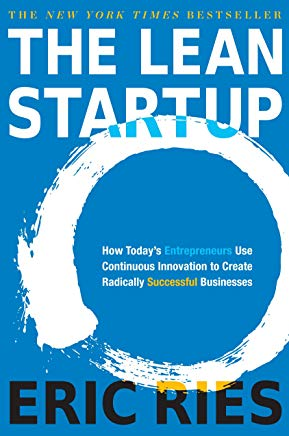
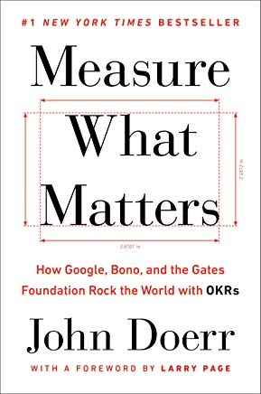
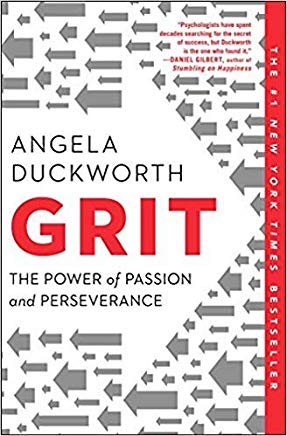

# Books I Love

# [The Lean Startup](http://theleanstartup.com/)

image taken from amazon.com

Eric Ries explains beautifully how to apply the scientific method, and the lean
manufacturing methodology, to software development and design. Rather than
building what your customers say they want, focus on measuring customer
behavior, and experiment to figure out what works.

# [OKRs Measure What Matters](https://www.whatmatters.com/)

image taken from amazon.com

John Doerr recounts his experience with his mentors management system. OKRs
(i.e. Objectives and Key Results) framework how to prioritize what is most
important to be doing, help employees stretch for excellence, and inform
leadership the capacity and direction of the company. With well applied OKRs
there is less confusion and more company unity.

# [Grit: The Power of Passion and Perserverance](https://angeladuckworth.com/grit-book/)

image taken from amazon.com

Angela Duckworth summarizes her extensive research into what makes people
successful. She found that grit, the ability to stick with something to it's
completion, is the number one determiner for successful people. She explains how
you can become more gritty, and how to help those around you do the same. Top
level goals are a main focus in her book and give direction on what you should
be gritty with and what you should give up on.
