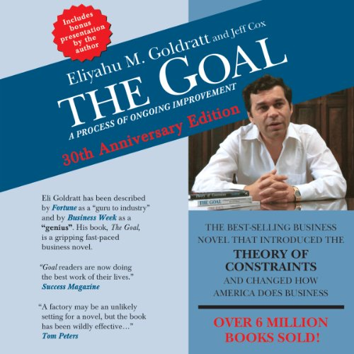
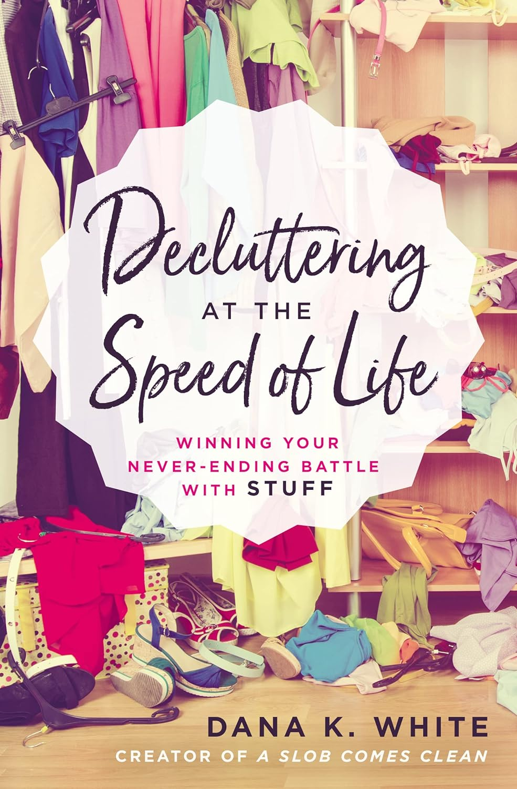
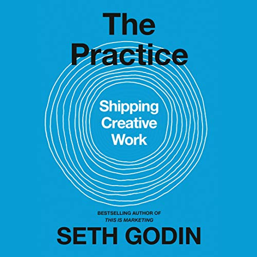

# Books I Love

# [The Goal](<https://en.wikipedia.org/wiki/The_Goal_(novel)>)

image taken from amazon.com

The goal lays out, in exacting terms, what a company needs in order to succeed.
The Theory of Constraints described in the book is a physisyist's approach to
business. Having an first principles understanding of how things work is
extremely important. The goal showcases this approach to something most people
think is a gut feeling: business. Even more important are his considerations
around when something is complete. Contrary to popular belief software isn't
done until the customer is gaining value from it.

# [Decluttering at the Speed of Life](https://www.aslobcomesclean.com/)

image taken from amazon.com

Dana K White lays out her journey to getting her house in order. As in
everything in life I draw a lot of parallels from this book into software. You
aren't ever given a truly greenfield situation. The way out of messes isn't to
"get a bigger house with more space" (or hire more developers) It's to slowly
and methodically reduce the amount of crap you are dealing with. This is often a
painful process but making software is all about pain.

# [The Practice: Shipping Creative Work](https://angeladuckworth.com/grit-book/)

image taken from amazon.com

Seth Godin's book is an answer to the question "What would a hug look like if it
was a book". Creative work is grueling, and often thankless. This book points
out that it's normal for creative work to be that way. People who do great
things aren't magically better at stuff, they are just more persistent and
thoughtful about what they are doing. Ultimately shipping creative work doesn't
have a manual. If it had one it wouldn't be creative.

## Other Books I've read / am reading

_in no particular order_

- The Phoenix Project
- Hunt Gather Parent
- Critical Chain
- Beyond the Goal
- How to talk so little kids will listen
- Team Topologies
- The 4 Stages of Psychological Safety
- Giftology
- ABM is B2B
- How to Manage Your Home Without Losing Your Mind
- Zero to One
- The Innovator's Dilemma
- Smarter Faster Better
- Leadershift
- Start with Why
- Educated
- Better than Before
- Crucial Conversations
- Tribal Leadership
- Good to Great
- The Culture Code
- Radical Candor
- Measure what Matters
- The Soul of a New Machine
- Grit
- The Challenger Sale
- The Lean Startup
- And basically everything that Brandon Sanderson has ever published.
